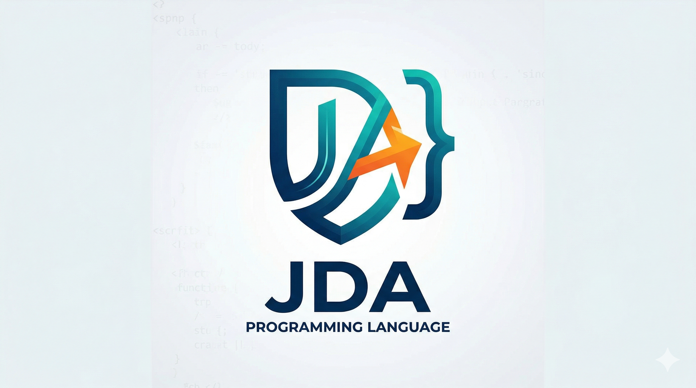

<p align="center">
  
</p>

<h1 align="center">Jda</h1>

<p align="center">A systems programming language built from scratch — zero dependency on C, C++, Rust, or Python.<br>Bootstrapped from raw x86-64 assembly. The compiler compiles itself.</p>

Jda is designed to resolve the performance/safety/ergonomics trilemma:

- **Replace the C stack** — no libc, direct kernel syscalls, zero dependency conflicts
- **Displace Python in AI** — native tensor primitives and compile-time autograd, no "two-language problem"
- **Match Go's scalability** — lightweight actor-based concurrency without GC pauses
- **Emulate Ruby's joy** — clean block-based syntax, minimal boilerplate

## Current Status

**Phase 1 complete: self-hosting achieved** (April 2, 2026).

The compiler reaches a fixed point — it compiles its own source and produces an identical binary:

```
jda0 (asm) → jda1 (374 KB) → jda1_sh2 (1.77 MB) → jda1_sh3 → jda1_sh4
                                                     ^^^^^^^^^^^^^^^^^^^^^^^^
                                                     byte-identical — converged
```

C and C++ are officially eliminated from the toolchain. The Jda compiler is written entirely in Jda.

## Language Features (Current)

```jda
struct Point {
    x: i64
    y: i64
}

fn distance(a: &Point, b: &Point) -> i64 {
    let dx = b.x - a.x
    let dy = b.y - a.y
    ret dx * dx + dy * dy
}

fn main() -> i64 {
    let p1 = Point{}
    let p2 = Point{}
    p1.x = 3
    p1.y = 4
    p2.x = 6
    p2.y = 8
    let d = distance(&p1, &p2)
    print_i64(d)
    print("\n")
    ret 0
}
```

**Working**: functions, structs, arrays, pointers, references, if/else-if/else, loops, const declarations, logical operators, inline assembly, syscalls, string literals with escapes, print/print_i64, SSA-based IR with constant folding and DCE, register allocator with spill, x86-64 native code generation, ELF binary output.

## Quick Install (Linux x86-64)

```bash
curl -fsSL https://raw.githubusercontent.com/jdalang/jda-lang/main/install.sh | bash
```

Or specify a version:

```bash
JDA_VERSION=0.1.0 curl -fsSL https://raw.githubusercontent.com/jdalang/jda-lang/main/install.sh | bash
```

## Building from Source

Requires Docker Desktop (builds target Linux x86-64). No NASM or assembly tools needed — the bootstrap compiler is a self-hosted Jda binary.

```bash
# Build the Docker image (once)
docker build -t jda-build docker/

# Build jda1 from the bootstrap compiler
docker run --rm --platform linux/amd64 --ulimit stack=524288000:524288000 \
  -v $(PWD):/jda -w /jda/bootstrap/stage0 jda-build make stage1

# Verify self-hosting convergence
docker run --rm --platform linux/amd64 --ulimit stack=524288000:524288000 \
  -v $(PWD):/jda -w /jda/bootstrap/stage0 jda-build make selfhost
```

## CLI Usage

```bash
# Compile a .jda file (output name derived from input: hello.jda → hello)
jda build hello.jda

# Compile with explicit output path
jda build hello.jda -o my_binary

# Compile and run immediately
jda run hello.jda

# Show version
jda --version

# Show help
jda --help
```

Legacy syntax is also supported for backward compatibility:

```bash
jda hello.jda output_binary
```

### Standard Library (53 packages)

Use `--include` to link standard library packages:

```bash
jda build --include stdlib/prelude.jda myapp.jda
jda build --include stdlib/vec.jda --include stdlib/sort.jda myapp.jda
```

Or install packages locally:

```bash
jda pkg install vec           # copy to lib/
jda pkg install sort
jda pkg search hash           # search packages
```

**Data Structures**: vec, hashmap, set, queue, heap, ring, matrix, tuple
**Algorithms**: sort, iter, comprehension, tsort
**Strings/Encoding**: string, fmt, conv, regex, base64, json, csv, uri
**I/O & Networking**: fs, file_io, find, tempfile, net/tcp, net/http, net/ws
**System**: os, process, time, timeout, context, args, shell
**Crypto**: crypto (AES, SHA-256, ChaCha20), uuid
**Testing**: testing, benchmark, log, pp
**AI/ML**: tensor_ops, autograd, nn, transformer, avx512_ops, ptx, rocm

See [stdlib/PACKAGES.md](stdlib/PACKAGES.md) for the complete list, or [docs/stdlib-md/](docs/stdlib-md/index.md) for full API docs.

### OOP Model

Jda uses **struct + trait + impl** (like Rust, not class-based):

```jda
trait Shape {
    fn area(self: &Self) -> i64
}

struct Circle { radius: i64 }

impl Shape for Circle {
    fn area(self: &Circle) -> i64 { ret self.radius * self.radius * 3 }
}

derive(Debug, Eq, Clone)
struct Config { width: i64  height: i64 }
```

See [docs/language/structs.md](docs/language/structs.md) for the full OOP guide.

## Repository Layout

```
bootstrap/
  stage0/          Build system + jda0 (assembly bootstrap)
  stage1/          jda1 compiler source (jda1.jda — self-hosted)
stdlib/            53 standard library packages
tools/             CLI tools (jda, jda-doc, jda-test, jda-pkg, etc.)
tests/             291 pass + 7 fail conformance tests
examples/          Example programs
docs/
  language/        Language reference (syntax, structs/OOP, stdlib, toolchain, compiler)
  stdlib/          HTML API docs (generated by jda-doc)
  stdlib-md/       Markdown API docs for GitHub (generated by jda-doc-md)
  contributing/    Contributing guide
docker/            Dockerfile for build environment
```

## Documentation

### Language Reference (Markdown — GitHub)
- [Syntax](docs/language/syntax.md) — variables, types, functions, control flow, operators
- [Structs & OOP](docs/language/structs.md) — structs, traits, impl, derive, generics, closures, unsafe
- [Standard Library](docs/language/stdlib.md) — all 53 packages by category
- [Toolchain](docs/language/toolchain.md) — CLI commands, package manager, doc generator, testing
- [Compiler Architecture](docs/language/compiler.md) — pipeline, data structures, self-hosting

### API Reference
- [Markdown docs](docs/stdlib-md/index.md) — GitHub-compatible, per-package API reference
- [HTML docs](docs/stdlib/) — website-ready, generated by `jda doc`

### Contributing
- [Contributing Guide](CONTRIBUTING.md) — how to build, test, and submit changes

### Design Documents
- `Jda_A_Convergence_Architecture_for_Post-Moore_Systems_Programming.docx`
- `Jda-Language-Technical-Implementation-Guide.docx`
- `Jda-AI-Prompt-Master-Guide.docx`
